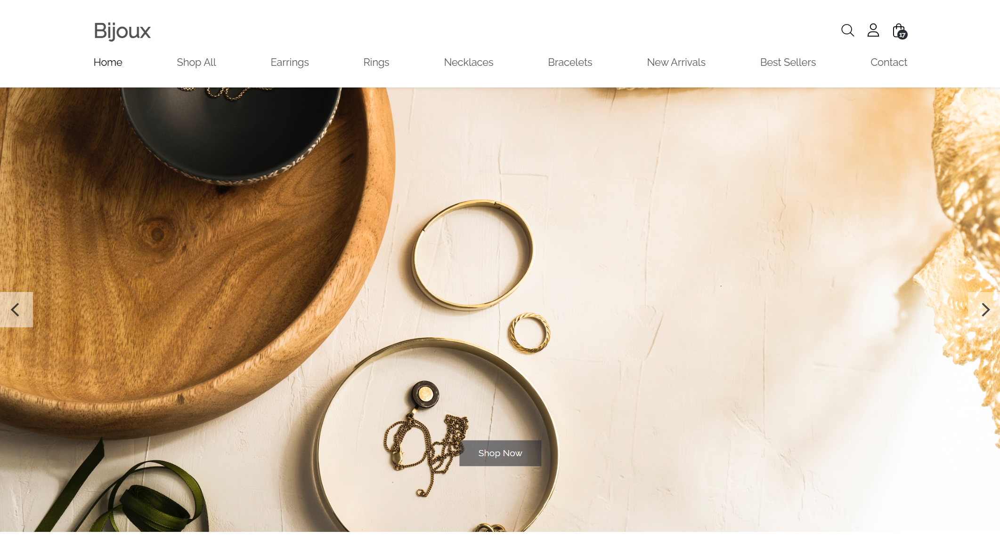
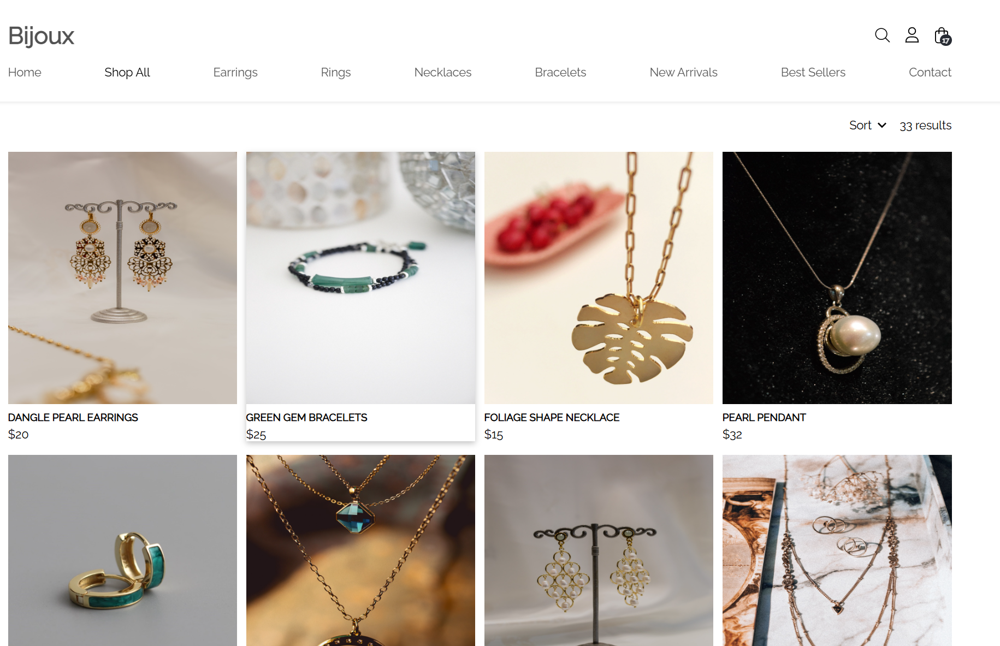
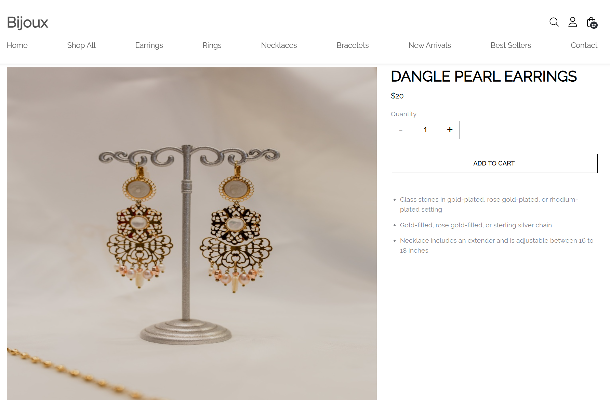
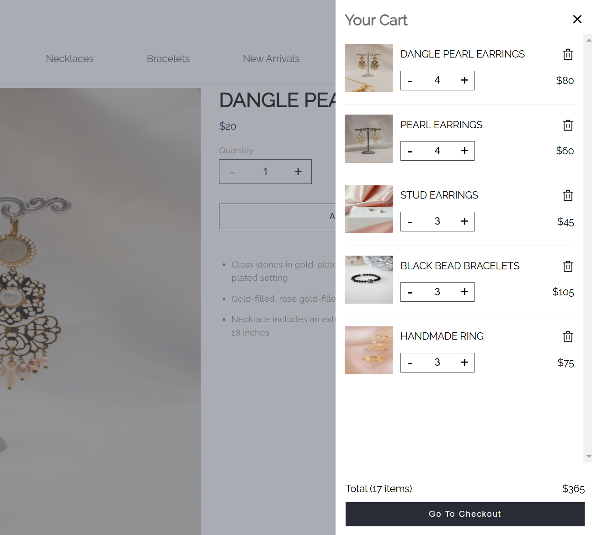
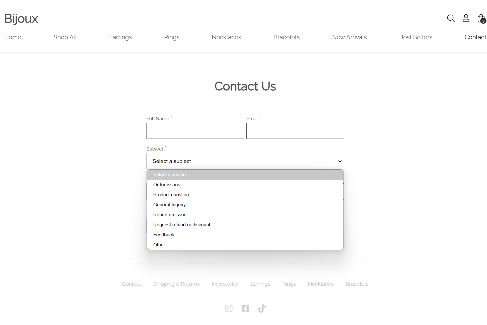

# Bijoux

An e-commerce platform built with React and Django.

### Introduction
To get set up, run:
```bash
npm start
```
CD into directory `backend/` then run:
```bash
pipenv shell
python manage.py runserver
```
Open http://127.0.0.1:3000/ to see the website.

### Features
- **User Management:** Users can edit account info.
- **Product Showcase:** Products are organized into categories for easier navigation.
- **Cart Management:** An efficient cart functionality ensures users can conveniently choose and check their items.
- **Custom Services:** A user-friendly custom services interface allows clients to easily design and manage their specific needs.
### Previews
**Home**


**Products**


**Product Details**


**Shopping Cart**


**Contact Form**
